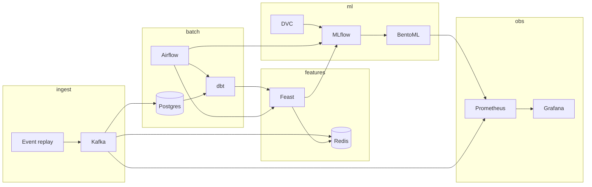

# ecommerce-conversion-pipeline

Real-time e-commerce conversion prediction demo: score the likelihood a shopper completes a purchase during an active session.

Built on the [Olist Brazilian E-Commerce](https://www.kaggle.com/datasets/olistbr/brazilian-ecommerce) dataset, replayed as a live event stream for demos and portfolio use.

## Use case

When a user views a product, adds to cart, or reaches checkout, the pipeline:

1. Ingests behavioral events through **Kafka**
2. Updates session features in **Redis** (online store)
3. Joins batch features from the warehouse via **Feast**
4. Serves a conversion probability from **BentoML**
5. Exposes latency, throughput, and business KPIs in **Grafana**

**Label:** `purchased_within_session` (derived from order timestamps during replay).

## Stack

| Layer | Tool | Role |
|-------|------|------|
| Ingestion | Kafka | `page_view`, `add_to_cart`, `checkout_start`, `purchase` events |
| Transform | dbt | Warehouse models → user/product/session feature tables |
| Orchestration | Airflow | Scheduled batch pipeline: dbt → Feast materialize → train |
| Versioning | DVC | Dataset snapshots and reproducible pipeline stages |
| Features | Feast + Redis | Offline store (warehouse) + online store (low-latency lookup) |
| Training | MLflow | Experiment tracking, model registry |
| Serving | BentoML | Real-time `/predict` API |
| Observability | Prometheus + Grafana | Pipeline health, inference latency, conversion metrics |

## Architecture



**Two paths:**

- **Real-time** — Kafka → Redis session features → BentoML inference
- **Batch** — Airflow DAG (`conversion_batch_training`) runs dbt, Feast materialization, and MLflow training on a schedule (daily)

## Repository layout

```
.
├── compose.yml              # Local infra (Postgres, Redis, Airflow, …)
├── dvc.yaml                 # DVC pipeline definition
├── airflow/
│   ├── dags/                # Batch training DAGs
│   ├── logs/
│   └── plugins/
├── data/
│   └── raw/                 # Olist CSVs (not committed; see data/README.md)
├── dbt/                     # Warehouse transforms and feature tables
├── feast/                   # Feast feature definitions and materialization
├── infra/
│   └── postgres/init/       # Airflow metadata DB bootstrap
├── streaming/
│   ├── replay/              # Replay Olist orders as Kafka events
│   └── consumer/            # Stream processor → Redis online features
├── training/                # Model training scripts (invoked by Airflow)
├── serving/                 # BentoML service and model packaging
└── observability/
    ├── prometheus/          # Scrape config
    └── grafana/             # Dashboards
```

## Features (planned)

**Batch (dbt → Feast offline store)**

- `user_total_orders`, `user_avg_order_value`
- `product_conversion_rate_7d`, `product_view_count_7d`
- `seller_avg_review_score`

**Real-time (Kafka → Redis via Feast online store)**

- `session_page_views`, `session_cart_value`
- `minutes_since_last_event`, `checkout_started`

## Prerequisites

- Docker and Docker Compose
- Python 3.11+
- [Kaggle CLI](https://github.com/Kaggle/kaggle-api) (to download Olist data)
- Optional: `dvc`, `dbt-core`, `feast`, `bentoml` (installed via project tooling later)

## Quick start

```bash
# 1. Clone and configure
cp .env.example .env
# Linux/macOS: ensure Airflow can write logs
mkdir -p airflow/logs && echo -e "AIRFLOW_UID=$(id -u)" >> .env

# 2. Download Olist dataset into data/raw/
#    See data/README.md

# 3. Start infrastructure
docker compose up -d

# 4. Open Airflow UI → http://localhost:8080 (admin / admin)
#    Unpause DAG: conversion_batch_training

# 5. Build warehouse features (manual until DAG tasks are implemented)
cd dbt && dbt run

# 6. Register and materialize Feast features
cd feast && feast apply

# 7. Train via Airflow DAG or locally
dvc repro
python training/train.py

# 8. Serve model
bentoml serve serving/service.py
```

## Build order

| Phase | Work |
|-------|------|
| 1 | `compose.yml` — Postgres, Redis, Airflow, Kafka, MLflow, Prometheus, Grafana |
| 2 | `data/` + DVC — pin Olist snapshot |
| 3 | `dbt/` — staging + feature mart models |
| 4 | `feast/` — feature views, offline/online stores |
| 5 | `airflow/` — wire `conversion_batch_training` DAG tasks |
| 6 | `streaming/` — event replay + Redis writer |
| 7 | `training/` — baseline model + MLflow (called from Airflow) |
| 8 | `serving/` — BentoML API |
| 9 | `observability/` — dashboards and alerts |

## Related repo

Companion fraud-detection demo: **ecommerce-fraud-pipeline** (checkout payment risk on IEEE-CIS data).

## License

MIT
